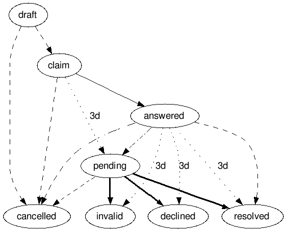

.. Kicking page rebuild 2014-10-30 17:00:08
.. _complaints:

..
    contents:: Table of Contents
   :depth: 2
   :local:

Complaint Workflow
==================

For more detailed information read `Complaints <http://openprocurement.org/en/complaints.html>`_.

Workflow
--------

Roles
-----

:Complainant:
    dashed

:Procuring entity:
    plain

:Reviewer:
    bold

:Chronograph:
    dotted

Statuses
--------

:draft:
    Initial status

    Complainant can submit claim, upload documents, cancel claim, and re-submit it.

:claim:
    Procuring entity can upload documents and answer to claim.

    Complainant can cancel claim.

:answered:
    Complainant can cancel claim, upload documents, accept solution or escalate claim to complaint.

:pending:
    Reviewer can upload documents and review complaint.

    Complainant can cancel claim.

:invalid:
    Terminal status

    Complaint recognized as invalid.

:declined:
    Terminal status

    Complaint recognized as declined.

:resolved:
    Terminal status

    Complaint recognized as resolved.

:cancelled:
    Terminal status

    Complaint cancelled by complainant.

Claim Submission
=================

If tender conditions are favoriting only one provider, or in any other viable case, one can submit Tender Conditions Claim.

Tender Conditions Claim Submission (with documents)
---------------------------------------------------

At first create a claim:

.. include:: tutorial/complaint-submission.http
   :code:

Then upload necessary documents:
   
.. include:: tutorial/complaint-submission-upload.http
   :code:

Submit tender conditions claim:
   
.. include:: tutorial/complaint-claim.http
   :code:

Tender Conditions Claim Submission (without documents)
------------------------------------------------------

.. include:: tutorial/complaint-submission-claim.http
   :code:

Tender Conditions Claim/Complaint Retrieval
-------------------------------------

You can list all Tender Conditions Claims/Complaints:

.. include:: tutorial/complaints-list.http
   :code:

And check individual complaint or claim:

.. include:: tutorial/complaint.http
   :code:

..
    Tender Award Complaint Submission
    ---------------------------------

    .. include:: tutorial/award-complaint-submission.http
    :code:

    Tender Award Complaint Retrieval
    --------------------------------

    You can list all complaints:

    .. include:: tutorial/award-complaints-list.http
    :code:

    And check individual complaint:

    .. include:: tutorial/award-complaint.http
    :code:

Claim's Answer
==============

Answer to resolved claim
------------------------

.. include:: tutorial/complaint-answer.http
   :code:

Satisfied Claim
===============

Satisfying resolution
---------------------

.. include:: tutorial/complaint-satisfy.http
   :code:

Escalate claim to complaint
---------------------------

.. include:: tutorial/complaint-escalate.http
   :code:

Complaint Resolution
====================

Rejecting Tender Conditions Complaint
-------------------------------------

.. include:: tutorial/complaint-reject.http
   :code:

Submitting Tender Conditions Complaint Resolution
-------------------------------------------------

The Complaint Review Body uploads the resolution document:

.. include:: tutorial/complaint-resolution-upload.http
   :code:

And either resolves complaint:

.. include:: tutorial/complaint-resolve.http
   :code:

Or declines it:

.. include:: tutorial/complaint-decline.http
   :code:

..
    Rejecting Tender Award Complaint
    --------------------------------

    .. include:: tutorial/award-complaint-reject.http
    :code:

    Submitting Tender Award Complaint Resolution
    --------------------------------------------
    
    .. include:: tutorial/award-complaint-resolution-upload.http
    :code:

    .. include:: tutorial/award-complaint-resolve.http
    :code:

    .. include:: tutorial/award-complaint-decline.http
    :code:
 